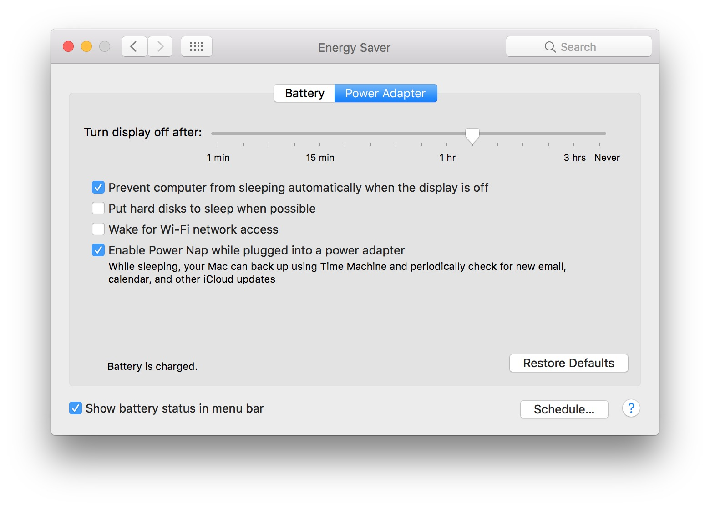
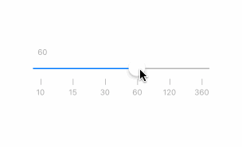

# IrregularSlider [](https://github.com/iDevHank/IrregularSlider/blob/master/LICENSE) [](#carthage) 
An irregular slider based on UISlider.

## What is IrregularSlider?

`UISlider` only supports regular unit.
But sometimes we need a irregular slider like Energy Saver in macOS.



IrregularSlider is a control based on `UISlider` by calculating its inner values. And it has stickness.



## Usage

### Slider view
contains the slider and coordinate labels:
```swift
let sliderView = IrregularSliderView(frame: someFrame, anchorPoints: [10, 15, 30 ,60 ,120, 360])
sliderView.value = 100
```
`anchorPoints` is an array which contains the points you want to set.
`value` is the current value just like `UISlider`.

### Slider only
```swift
let slider = IrregularSlider(frame: someFrame, anchorPoints: [10, 15, 30 ,60 ,120, 360])
slider.selectedValue = 100
```
Here we use `selectedValue` instead of `value` in `UISlider`.

## Getting started

### Carthage
If you use Carthage to manage your dependencies, simply add IrregularSlider to your `Cartfile`:

```
github "iDevHank/IrregularSlider"
```

If you use Carthage to build your dependencies, make sure you have added `IrregularSlider.framework` to the "_Linked Frameworks and Libraries_" section of your target, and have included them in your Carthage framework copying build phase.

## Have a question?

If you need any help, please visit our GitHub issues or send me an E-Mail(iDevHank@Gmail.com). Feel free to file an issue if you do not manage to find any solution from the archives.
